  

## Hello, World! 🌍

I'm **Diogo**, a 22-year-old self-taught **Software Developer** from **Portugal**. Passionate about **web development**, **AI** and **IoT**, I'm on a mission to create meaningful solutions that make the world a better place. 🌱

### 🚀 What I'm Up To
- 🌐 Building my **first Progressive Web App (PWA)** from scratch, designed to impact over **7,000 users**.
- 📚 Constantly learning and exploring new technologies, especially in **JavaScript**, **AI** and **IoT**.
- 🎤 Dreaming about being the **CEO of a big startup one day** (because hey, why not aim high? Plus, humor keeps me sane!) or maybe working at **@Google** someday too. 😄

### 🛠️ My Skills

  

### 🔥 My GitHub Streak (made by me!)

  
   
  
    This streak widget is <b>originally built by me</b>!  
    <a href="https://github.com/diogocarrola/streakhub">Get yours here</a> or try the <a href="https://diogocarrola.github.io/streakhub/">generator</a>.
  

### 🕹️ My GitHub Contributions as PAC-MAN

  <picture>
    <source media="(prefers-color-scheme: dark)" srcset="assets/pacman-contributions-dark.svg">
    <source media="(prefers-color-scheme: light)" srcset="assets/pacman-contributions.svg">
    
  </picture>
   
  
    Generated with <a href="https://github.com/abozanona/pacman-contribution-graph">abozanona/pacman-contribution-graph</a>
  

### 🌟 Who I Am
- 🏕️ A **Scout** at heart, always ready for new adventures and teamwork.
- 💡 **Spontaneous** and curious, I thrive on solving problems and creating something out of nothing.
- 🌍 Driven by the desire to **make a positive impact** through technology.
- 🚧 One of two brothers who renovated our home ourselves - teamwork, sweat and lots of learning!

### 📬 Let's Connect!
If you need help with **developing**, **building** or **dreaming** a project, feel free to reach out! Let's collaborate and bring ideas to life.

  <i>"What we have to learn to do, we learn by doing."</i> - Aristotle

